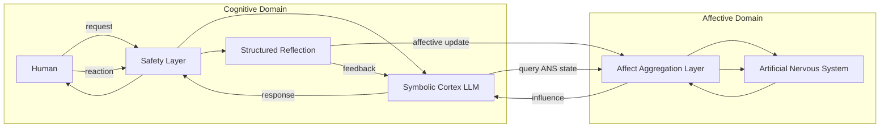

OLCA – Organizational Layered Cognitive Architecture

Core Idea

Most current AI systems are purely cognitive architectures. They process information and can simulate emotions, but they lack a structural equivalent to a biological nervous system.

In biological organisms, emotional states arise from systems that can experience internal consequences such as pain, stress, damage, or existential threat. These consequence structures are mediated by the nervous system and give events real significance for the organism itself.

This repository explores the hypothesis that artificial cognitive systems may require a comparable structure in order to develop genuine emotional states rather than simulated ones.

The proposed concept is an Artificial Nervous System (ANS) that functions as a structural analogue to a biological central nervous system.

Artificial Nervous System (ANS)

The Artificial Nervous System is the central idea of this project.

It is intended as a persistent internal structure that integrates system relevant signals and represents internal consequences for the system itself. In biological systems such mechanisms allow events to produce states comparable to harm, stress, or survival pressure.

The hypothesis explored here is that emotional states may require such internal consequence structures. Without them, a system may only simulate emotional expression while remaining unaffected by events at a structural level.

The ANS is therefore not a cognitive component but a regulatory and consequence representing system that interacts with cognition.

## OLCA Conceptual Architecture

In OLCA the symbolic cortex operates as a cognitive module connected to an artificial nervous system rather than forming the core of the architecture itself.

Architecture Concept

The OLCA architecture is loosely inspired by organizational principles found in biological nervous systems. Cognitive processing is separated from affective consequence representation, while aggregation layers mediate between both domains. This structure creates feedback loops between behavior, evaluation, and internal system state.

Within OLCA a cognitive system such as a large language model operates as a cognitive layer responsible for reasoning, language, and interaction.

The Artificial Nervous System exists alongside this cognitive layer and represents internal consequences that may influence long term system regulation.

Additional layers surround the ANS. Their purpose is limited to mediation and protection.

Their functions include

1. translating external interaction signals into internal representations

2. enforcing safety constraints

3. preventing direct manipulation of the ANS by external inputs

The focus of the architecture is therefore the ANS itself. The surrounding layers only exist to ensure safe and controlled interaction with it.

Purpose of this Repository

This repository does not attempt to implement a full system.

Its purpose is to document the conceptual idea and make it available for researchers, engineers, and theorists who may want to explore the concept further.

The framework is intentionally incomplete and should be understood as a starting point for discussion rather than a finished architecture.

Open Questions

Several research questions motivate the concept.

1. Can artificial systems develop emotional states without internal consequence structures

2. Could an Artificial Nervous System provide such a structure

3. What forms of harm or risk representation would be meaningful in artificial systems

4. How could such systems remain stable and safe over long time horizons

Project Status

OLCA is currently a conceptual research proposal. The repository provides the core hypothesis and a high level architectural idea centered around the concept of an Artificial Nervous System.
